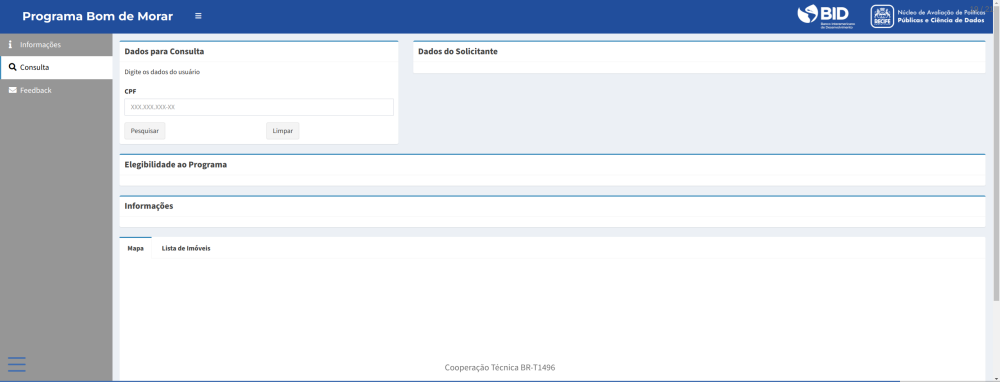

# PoC Programa Bom de Morar


## Tabela de Conteúdo:
---

- [Descrição](#descricao)
- [Guia do usuário](#guia-do-usuario)
- [Guia de instalação](#guia-de-instalacao)
- [Autores](#autores)
- [Licença](#licenca)

## Descrição <a name="descricao"></a>
---

Para avançar no quesito de políticas habitacionais, a Prefeitura do Recife
está lançando um novo programa, o Programa Bom de Morar, que visa subsidiar
o aluguel de imóveis urbanos para famílias de baixa renda. 


A solução desenvolvida no âmbito da Cooperação Técnica BR-T1496 tem como objetivo
auxiliar na classificação de elegibilidades das famílias, na contabilização do 
valor do subsídio e, por fim, na exposição dos imóveis apropriados a situação de 
cada família. A PoC do Programa Bom de Morar consiste na construção de uma 
plataforma que visa traduzir todos os critérios de elegibilidade estabelecidos no Artigo 2° 
da Lei Ordinária 18.967 em algoritmos e dessa forma automatizar todo o processo 
de triagem, promovendo rapidez e ganho de produtividade na implementação do
programa social.

Para o desenvolvimento da aplicação foram utilizados as seguintes banco
de dados para a checagem:

- **CadÚnico**;
- **Auxílio Moradia**;
- **Auxílio Acolhida**;
- **Programa Habitacional**;


Dado o grande volume de dados do necessários para a aplicação, todos os bancos de dados foram convertido em formado *parquet*.  

A Figura a seguir demonstra graficamente como o algoritmo checa os critérios de elegibilidade do programa através de consultas aos diferentes bancos de dados:


## Guia do Usuário <a name="guia-do-usuario"> </a>
---

A tela inicial da aplicação mostra algumas informações sobre o Programa
Bom de Morar, em especial os critérios de elegibilidade contidos na Lei que
foram traduzidos em algoritmos para triagem automática.

A aplicação do programa Bom de Morar foi desenvolvida voltada para o agente público
responsável pela a execução do programa. Com a informação do CPF do solicitante
do benefício, a aplicação irá se conectar com os bancos de dados do *CadÚnico*, 
*Auxílio Moradia*, *Auxílio Acolhida* e a base de dados de outros *programas habitacionais* 
para checar a elegibilidade do solicitante segundo os vários critérios definidos em lei. 



Uma vez que o requerente seja elegível, a aplicação irá automaticamente 
calcular o valor do benefício concedido baseado nas informações listadas nas
base de dados citadas, assim como listar quais imóveis estão disponíveis para 
locação, características da residência, entre outras informações. 
Em caso de não elegibilidade, a aplicação informará qual critério não está sendo
atendido, permitindo que haja algum encaminhamento por parte da prefeitura do
Recife.


## Guia de Implementação  <a name="guia-do-implementacao"> </a>
---

A implementação da aplicação do programa Bom de Morar é bastante simples e seguirá
tres passos simples. São eles:

1. Download do software `R` e as bibliotecas necessárias;
2. Download dos códigos-fonte da aplicação;
3. Disponibilização dos bancos de dados necessários;
4. Execução da aplicação.

### Download de software:

A aplicação foi escrita na linguagem [R](https://www.r-project.org/), e utilizando as seguintes bibliotecas para a criação do dashboard:

- *shiny*;
- *shinydashboard*;
- *shinydashboardPlus*;
- *shinyWidgets*;
- *data.table*;
- *tidyverse*;
- *lubridate*;
- *leaflet*;	
- *arrow*.

Após a instalação do `R` e das bibliotecas listadas anteriormente, o próximo é
obter os arquivos da aplicação.

### Clonando repositório remoto:

É possível realizar o download dos arquivos da aplicação através do 
repositório remoto do GitHub. Através da linha de commando:

```sh 
git clone <url>
```

### Organizando bancos de dados: 


A pasta com os arquivos da aplicação contem todos os códigos necessários para 
rodar a aplicação. O próximo passo é a preparação dos bancos de dados. 
A implementação da aplicação requer os arquivos dos bancos de dados utilizados para
a checagem dos critérios de elegibilidade em formato *parquet*. As bases de dados 
utilizadas nesta solução são:

- **CadÚnico**;
- **Auxílio Moradia**;
- **Auxílio Acolhida**;
- **Programa Habitacional**;
- **Base de Imóveis**;

Esses bancos de dados devem ser salvos nos diretórios `data/cadunico`, 
`data/auxilioMoradia`, `data/auxilioAcolhida` e `data/imoveis`.

### Executando a aplicação:

Com os bancos de dados no formato apropriado e salvo nas respectivas pastas, 
o último passo para executar a aplicação é executar o arquivo `app.R`.

Através da linha de comando, vá até a pasta 

```sh
Rscript app.R &
```


## Autores <a name="autores"></a>
---


- [Cleyton Farias](mailto:cleytonfarias@outlook.com "e-mail");

- [Rubens Lopes](mailto:lps.rubens@gmail.com "e-mail");


## Licença
---
